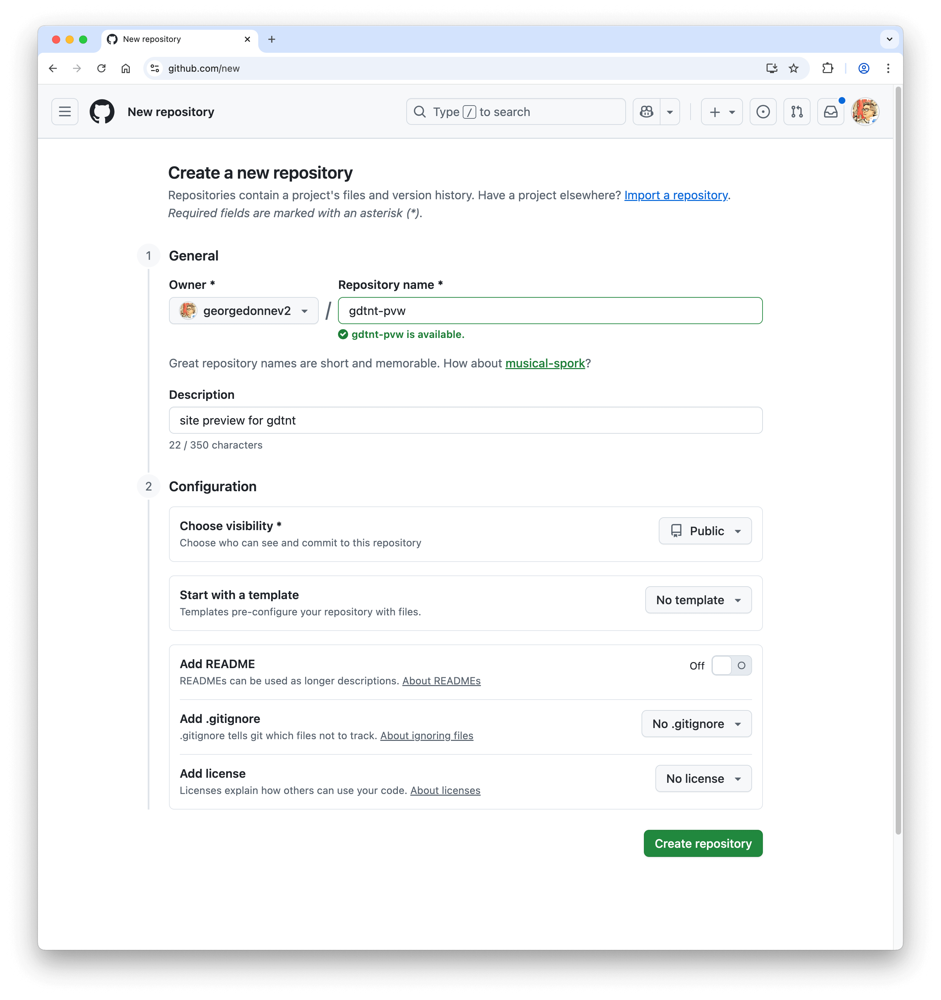
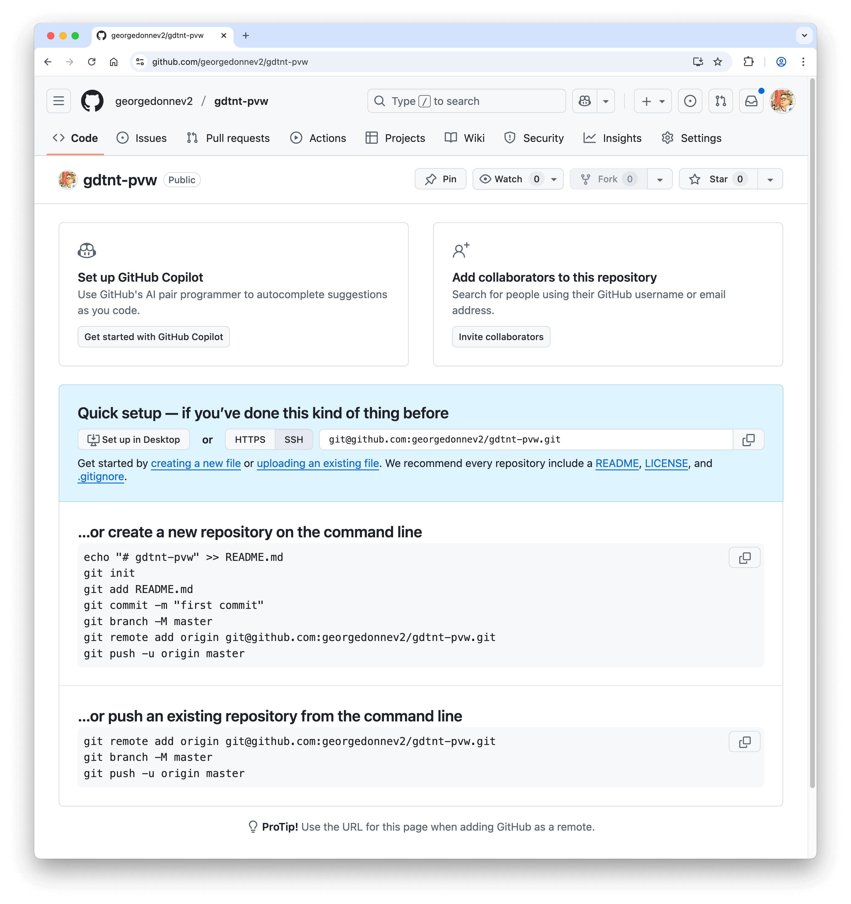

# 使用Github Pages建站
{: .no_toc }


<details open markdown="block">
  <summary>
    目录
  </summary>
  {: .text-delta }
1. TOC
{:toc}
</details>

## 创建预览网站

<br>
创建一个新的仓库，用于预览网站。比如 `gdtnt-pvw`。pvw 是 preview 的缩写的意思。



将已有的网站文档（一堆 markdown 文档），上传到新的仓库 `georgedonnev2/gdtnt-pvw`。



如果只有一个 github 账号，就可以按照界面提示的操作，就可以了。

```bash
~/gdtnt % git remote add origin git@github.com:georgedonnev2/gdtnt-pvw.git
~/gdtnt % git branch -M master
~/gdtnt % git push -u origin master
```

当前我有2个 github 账号，因此按默认操作会报错。
```bash
~/gdtnt % git push -u origin master
ERROR: Permission to georgedonnev2/gdtnt-pvw.git denied to GeorgeDonne.
fatal: Could not read from remote repository.

Please make sure you have the correct access rights
and the repository exists.
```

打开 HOME 目录下的 `~/.ssh/config` 文件，可以看到如下相关配置：
```bash
# github 账号1 的相关配置
Host github.com
  HostName github.com
  User git
  IdentityFile ~/.ssh/id_rsa

# github 账号2 的相关配置
Host githubgdv2.com
  HostName github.com
  User git
  IdentityFile ~/.ssh/id_rsa-gdv2olk
```

按上述操作，实际上是推动到 账号1 的仓库中，因此报错。需要推送到 账号2 的仓库中。

先看下 remote 配置：
```bash
~/gdtnt % git remote -vv
gdgitubv2	git@githubgdv2.com:georgedonnev2/gdtnt.git (fetch)
gdgitubv2	git@githubgdv2.com:georgedonnev2/gdtnt.git (push)
origin	git@github.com:georgedonnev2/gdtnt-pvw.git (fetch)
origin	git@github.com:georgedonnev2/gdtnt-pvw.git (push)
```

修改 remote 配置。先删除刚加的 `origin`，再新增 `gdgitubv2pvw`。
```bash
~/gdtnt % git remote rm origin
~/gdtnt % git remote add gdgitubv2pvw git@githubgdv2.com:georgedonnev2/gdtnt-pvw.git
~/gdtnt % git remote -vv  
gdgitubv2	git@githubgdv2.com:georgedonnev2/gdtnt.git (fetch)
gdgitubv2	git@githubgdv2.com:georgedonnev2/gdtnt.git (push)
gdgitubv2pvw	git@githubgdv2.com:georgedonnev2/gdtnt-pvw.git (fetch)
gdgitubv2pvw	git@githubgdv2.com:georgedonnev2/gdtnt-pvw.git (push)
```

然后尝试推动到 账号2 的仓库。就可以了。
```bash
~/gdtnt % git push -u gdgitubv2pvw
Enumerating objects: 202, done.
Counting objects: 100% (202/202), done.
Delta compression using up to 4 threads
Compressing objects: 100% (160/160), done.
Writing objects: 100% (202/202), 51.54 MiB | 1.33 MiB/s, done.
Total 202 (delta 74), reused 0 (delta 0), pack-reused 0
remote: Resolving deltas: 100% (74/74), done.
To githubgdv2.com:georgedonnev2/gdtnt-pvw.git
 * [new branch]      master -> master
branch 'master' set up to track 'gdgitubv2pvw/master'.
```
